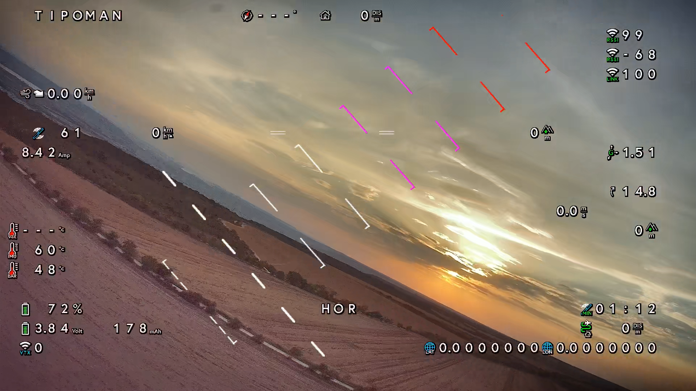
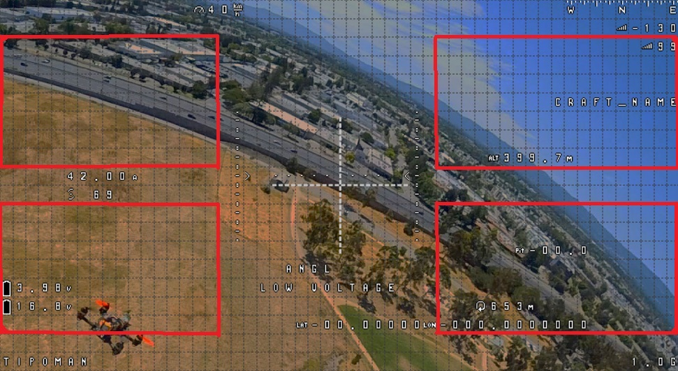
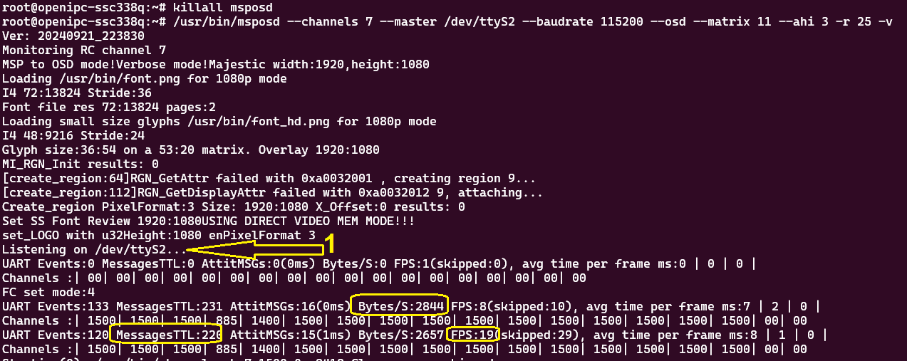

# MSPOSD

A tool for drawing betaflight/inav/ardupilot MSP Display Port OSD over OpenIPC video stream.

**Click the image below to watch a video sample:**
[](https://www.youtube.com/watch?v=4907k5c7b4U)

```
Usage: msposd [OPTIONS]
 -m --master      Serial port to receive MSP (%s by default)
 -b --baudrate    Serial port baudrate (%d by default)
 -o --output	  UDP endpoint to forward aggregated MSP messages
 -c --channels    RC Channel to listen for commands (0 by default) and exec channels.sh. This option can be repeated to allow listening for several channels.
 -w --wait        Delay before executing a command from RC Channel (2000ms default)
 -r --fps         Max MSP Display refresh rate(1..50)
 -p --persist     How long a channel value must persist to generate a command - for multiposition switches (0ms default)
 -t --temp        Read SoC temperature
 -d --wfb         Monitors wfb.log file and reports errors via HUD messages
 -s --osd         Parse MSP and draw OSD over the video
 -a --ahi         Draw graphic AHI, mode [0-No, 2-Simple 1-Ladder, 3-LadderEx (home indicator on ladder)]
 -x --matrix      OSD matrix [0- 53:20 , 1- 50:18 chars, 11- Variable font size, 9-bottom align 720p mode, 8-center align 720p mode]
    --mspvtx      Enable alpha mspvtx functionality
    --subtitle <path>  Enable OSD/SRT recording
 -v --verbose     Show debug info
 --help           Display this help
```

**Support for two font sizes.** (on FullHD mode only!)  
set --matrix  to a value 11 or higher, each value represents a template to be used to map the OSD config.  
```--matrix 11``` will use template 1. (click for a video sample)  
<a href="https://youtu.be/uKa1P8-Soxw">
    
</a>  
All the OSD symbols in the red rectangles will be rendered using smaller font size. They will be aligned to the outer corner of each rectangle (up-left for the upper left one).

## VTX Menu

### Stick commands


### VTXMenu INI File Format Guide

See: vtxmenu.ini

#### General Structure
- **Sections** represent individual pages.
- Each section can contain one of the following:
  - **Submenus** (which link to other sections).
  - **Options** (which allow user selections).
  - **Commands** (to perform specific actions).

#### Submenus
- **Submenus** are links that navigate to other sections within the INI file.

#### Options
- **Options** follow a specific colon-separated format, with parameters in this order:
  
  1. **Name** - The display name of the option.
  2. **Range/List** - A numeric range or list of allowed values.
  3. **Read Command** - The command to retrieve the current value.
  4. **Write Command** - The command to update the value. Use the `{}` placeholder to specify where the value will be placed in the write command.
  
  - **Range**: A numeric range of allowed values (e.g., `1-10`). You can use decimal syntax to denote more precision `0.1-20`.
  - **List**: A comma-separated list of selectable options (e.g., `On, Off, Auto`).

#### Commands
- **Commands** are colon-separated entries that define:
  
  1. **Label** - The text displayed to the user.
  2. **Action** - The command to be executed.


### Safeboot

The safeboot stick command will run `/usr/bin/safeboot.sh`.
Example:
```
#!/bin/sh
cp /etc/wfb.conf /etc/wfb.conf_before_safeboot
cp /etc/majestic.yaml /etc/majestic.yaml_before_safeboot
cp /etc/wfb.conf_safeboot /etc/wfb.conf
cp /etc/majestic.yaml_safeboot /etc/majestic.yaml
reboot
```
This will copy a known good config to the right place and reboot.
Use `Exit Camera menu` stick command (one or more times) to exit all flightcontroller and VTX menu screens before.

### MSPVTX

msposd has **alpha** support for mspVTX to Betaflight. use the `--mspvtx` switch to activate this. This will configure Betaflight vtx tables with the supported channles by the vtx. You can switch channels from within Betaflight menu, Betaflight Configurator, SpeedyBee App, ELRS VTXAdmin.


## OSD/SRT Recoding

msposd supports recording MSP DisplayPort messages to an OSD file. This can later be used to overlay the OSD if the video was recorded without it.
The OSD file is compatible with the [walksnail-osd-tool](https://github.com/avsaase/walksnail-osd-tool).
The SRT file records the additional MSPOSD.msg. This is not supported by walksnail-osd-tool but can be used in later video editing pipeline tools.

This feature monitors the recording directory for newly started .mp4 files.
Once detected, the SRT and OSD files will be created with the same name.
As soon as the MP4 file is closed, the recording of SRT and OSD files stops as well.

Air side needs special config to detect recordings. No recursive file watching is implmented.
Therefor majestic needs to record to a flat directory layout.

`cli -i /etc/majestic.yaml -s .records.path /mnt/mmcblk0p1/%F/..`


##  Options.
Forwarding of MSP packets via UDP.  
Can monitor RC Channels values in FC and call the script `channels.sh` (located at /usr/bin or /usr/sbin).Will passing the channel number and its value to it as $1 and $2 parameters. This allows for controlling the camera via the Remote Control Transmitter.  
AHI (Artificial Horizon Indicator) ladder - Graphical AHI , that is drawn over the standard OSD. 

**Show custom mesage and diagnostics** on screen when text is written to file /tmp/MSPOSD.msg 
```
echo "Custom Message... &L04 &F22 CPU:&C &B temp:&T\n Line 2 with more data" >/tmp/MSPOSD.msg
```
Extra params withing the message to be shown:
- &T - Board temperature  
- &W - WiFi module temperature (8812xx chipsets)
- &B - Video Bitrate and FPS  
- &C - CPU Usage percent  
- &t - Time  
- &Fxx - Set text font size (10 to 99)  
- &Lxx - Set text colour (first digit 0- white, 1 - black, 2- red, 3 - green, 4 - blue, 5 - yellow, 6 - magenta, 7 - cyan,  8 - orchid, 9 - dark red)   
         and postion on the screen( second digit)  0-TopLeft, 1-TopCenter, 2-TopRight, 3-TopMoving,4-BottomLeft, 5-BottomCenter, 6-BottomRight, 7-BottomMoving   
- &Gx - Set text backGround color (0- white, 1 - black, 2- blue, 3 - green, 4 - red, 5 - yellow, 6 - magenta, 7 - cyan,  8 - semi-transparent, 9 - transparent)
 -&p - Dropped packet injections by wfb-ng (on 8812xx extracted from /sys/class/net/wlan0/statistics/tx_dropped)  

Can have the text in multiple lines, each with different color and size, seperated by \n character
```echo -e "&L52&F24Line1 is purple with size24\nLine 2 is red, font size 20 &L32 &F20 \nLine3 bluish size 28&L42&F28&G8" > ./MSPOSD.msg```
will show three lines of text, each with different color and size. 
Unicode font characters can be specified with hexadecimal escape sequences in a C string literal. ```xEF\x80\x92 some battery``` will show battery symbol if present in the ttf font file used.

###  Custom OSD elements  
Custom elements can be added via the standard inav/bf/ardu OSD Configurator. A keyword needs to be added on the screen, that will be replaced by the corresponding widget.  
This keywords can be added using the PilotName/CraftName fields(INAV/BF/Ardu), or custom Text Elements(INAV only).  
 - ```!TMP!``` Camera board temp  
 - ```!TMW!``` WiFi module temperature (only 8812EU2/8733BU chipsets supported)  
 - ```!RC!``` Sticks Position widget (Ground Side only)  

### Usage Example:

```
msposd  --master /dev/ttyS2 --baudrate 115200 -c 7 -c 9 --out 127.0.0.1:14555 -osd -r 20 --ahi 1 -v
```
Read on  UART2 with baudrade 115200 and listen for value changes of RC channel 7 and channel 9 that come from the Remote Control via Flight Controller.
Every time the value is changed with more than 5% the bash script ```channels.sh {Channel} {Value}``` will be started with the provided parameters.  
Forward MSP to UDP port 14555 so that it can be handled by wfb-ng and sent to the ground.
Draw an Artificial Horizon Indicator (AHI) Ladder with color-coded vertical steps.
The refresh rate of the OSD is limited to 20 frames per second, depending on the Flight Controller and MSP DisplayPort implementation, usually ranging between 12 and 17 frames per second.

Font files for each Flight Controller firmware have two versions—one for 720p and one for 1080p resolutions. They should be named **font_hd.png** and **font.png** respectively, and saved in the **/usr/bin** folder on the camera.
They vary depending on the Flight Controller, so choose the appropriate pair.
The program will read from /etc/majestic.yaml and will select the type of font to use based on the video resolution configured there.

### To install:
Copy msposd for the architecture you need on the cam.  
Prebuild binaries for x86, SigmaStar, Goke and Hisilicon are at release/ folder.  
**For SigmaStar** based SoC (ssc338q, sc30kq) :
```
curl -L -o /usr/bin/msposd https://github.com/OpenIPC/msposd/releases/download/latest/msposd_star6e  
chmod 755 /usr/bin/msposd
```

___Since Nov 2024___ Program automatically selects the appropriate font file for the FC software used.  
font_inav.png/font_inav_hd.png | font_btfl.png/font_btfl_hd.png | font_ardu.png/font_ardu_hd.png files must be present in ```/usr/share/fonts/```


**To skip the autodetect, you can copy only the font files for the FC software you plan to use**  
**For INAV**:
```
mkdir /usr/share/fonts
curl -k -L -o /usr/share/fonts/font.png https://raw.githubusercontent.com/openipc/msposd/main/fonts/font_inav.png
curl -k -L -o /usr/share/fonts/font_hd.png https://raw.githubusercontent.com/openipc/msposd/main/fonts/font_inav_hd.png
```

**For Betaflight**: 
```
mkdir /usr/share/fonts
curl -k -L -o /usr/share/fonts/font.png https://raw.githubusercontent.com/openipc/msposd/main/fonts/font_btfl.png
curl -k -L -o /usr/share/fonts/font_hd.png https://raw.githubusercontent.com/openipc/msposd/main/fonts/font_btfl_hd.png
```

**For Ardupilot**:  
Set  
```SERIALx_PROTOCOL = 42``` replace x with the UART number.  
```OSD_TYPE = 5```  
To use betaflight fonts, set ```MSP_OPTIONS = 5``` and copy fonts for betaflight as shown above.
If you prefer to use ardupilot "native" fonts (more icons), then set ```MSP_OPTIONS = 0``` and copy the fonts below.
```
mkdir /usr/share/fonts
curl -k -L -o /usr/share/fonts/font.png https://raw.githubusercontent.com/openipc/msposd/main/fonts/font_ardu.png
curl -k -L -o /usr/share/fonts/font_hd.png https://raw.githubusercontent.com/openipc/msposd/main/fonts/font_ardu_hd.png
```

Start msposd or reference it in OpenIPC boot scripts.  

### To install on Goke/HiSilicon camera
```
curl -L -o /usr/bin/msposd curl -L -o /usr/bin/msposd https://github.com/OpenIPC/msposd/releases/download/latest/msposd_goke 
#or
curl -L -o /usr/bin/msposd curl -L -o /usr/bin/msposd https://github.com/OpenIPC/msposd/releases/download/latest/msposd_hisi 
chmod 755 /usr/bin/msposd
#Download an additional driver for Region Module
curl -k -L -o /lib/modules/4.9.37/goke/gk7205v200_rgn.ko https://github.com/OpenIPC/firmware/raw/89ded200eba00726930b8307ddaf573ac449f076/general/package/goke-osdrv-gk7205v200/files/kmod/gk7205v200_rgn.ko
sed -i "s!#insmod gk7205v200_rgn.ko!insmod gk7205v200_rgn.ko!g" "/usr/bin/load_goke"
reboot
```
On lower-end cameras like gk7205v200/v210 the OSD will work only in 1280x720 mode!

## Rendering on the ground station
This mode uses one MSPOSD running on the air unit, receiving MSP DisplayPort data from the FC, aggregating it and sending it via wfb_ng to the ground.    
On the ground another instance of MSPOSD renders these data and overlays it on the screen.  
Tested on x86 Ubuntu 6.5.0.28  
On the cam msposd can be started like this to forward via port 14550 (default mavlink, should not be used)  
```msposd --channels 7 --master /dev/ttyS2 --baudrate 115200 --out 127.0.0.1:14550 --matrix 11 --ahi 3 -r 30```   
On the ground:  
```msposd --master 127.0.0.1:14550  --osd -r 50 --ahi 3 --matrix 11 -v```  
Use ALT+Up/Down Arrow to center the AHI over horizon.

### Diagnosing
Q: _I see a static map of all characters on the screen but no realtime OSD_.  
A: There are no data being received by the cam.  
    - Check your wiring. You need Tx/Rx/Gnd wires.  Data lines must be crossed (Rx goes to Tx ).  
    - Check Inav/Ardu config. Enable MSP and OSD where needed! There is a separate option for OSD in INAV. Do not enable mavlink and msp on a single UART. (This is a bug in BF). Do not start msposd twice.  
    - On the cam. execute ```top``` , find the line for msposd, copy it (the whole line!) . Then ```killall msposd```, add   ```-v``` to the end of the line and start it.  
    Take a look at the console logs:  

<a href="pics/diag_1.png">
  
</a>  

If they are stuck at step 1, there is no data on the UART. If there are lines past step 1, but OSD is not visible, the signal is not the format expected - MSP Display Port. Take a look in values in yellow, how much MSP packets were extracted from the signal, the total amount of bytes per second etc.
Save this log to show it if requested.

Q: _OSD changes, but I see strange symbols on the screen_.  
A: Download the appropriate font set for you flight controller software. Check for loose connectors, speed settings and make sure you have ground wire between the FC and the cam.

Q: _With Betaflight, if AHI is shown but is not updated, even though msposd has "--ahi 1" argument and the telemetry is working._  
A: Check your connections, specifically Camera's TX <-> FC RX. Camera needs to request extra data from Flight controller for this feature to work. Betaflight can be configured to allow readonly mode, but then extra features like RC channels control and AHI will not work.

### Acknowledgements:
- Default fonts included in this project are created by SNEAKY_FPV.  These and other excellent additional fonts can be found here: https://sites.google.com/view/sneaky-fpv/home  
This work is based on these projects:
- https://github.com/fpv-wtf/msp-osd
- https://github.com/OpenIPC/osd
