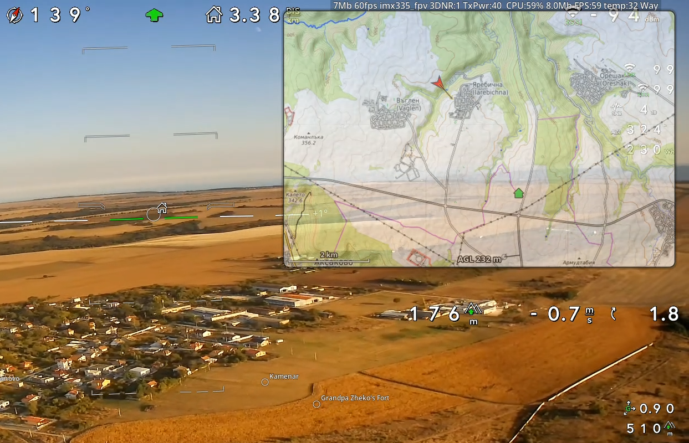

# Offline Moving Map — Ground Station

<a href="../pics/msp_map_1.png"></a>

Prepare a map of your flying area on any PC in advance, then fly with it drawn on the
OSD. No internet connection is needed at the field.

The workflow has two parts:

- **Preflight** (this folder): a local web app for browsing the world map, downloading
  the area you need, choosing its appearance and placing waypoints. The result is a
  **map pack**: a tile file plus a small database of points.
- **In flight**: `msposd` renders that pack straight into the OSD as a moving map,
  showing your aircraft, home position and waypoints. No browser is involved.

Copy the pack to the ground station once, and it keeps working fully offline.

---

## Download

The preflight map tool is available as a single ready-to-run file; no Python or other
install needed. It starts a local server and opens the map in your default browser.

| OS | File |
|---|---|
| Windows 10/11 | [mspmaptool_windows.exe](https://github.com/OpenIPC/msposd/releases/download/mspmaptool/mspmaptool_windows.exe) |
| Linux (x86-64) | [mspmaptool_linux](https://github.com/OpenIPC/msposd/releases/download/mspmaptool/mspmaptool_linux) |

Release notes and version: [mspmaptool release](https://github.com/OpenIPC/msposd/releases/tag/mspmaptool).

- **Windows:** run the `.exe`. It is not code-signed, so SmartScreen may warn; choose
  *More info* then *Run anyway*.
- **Linux:** `chmod +x mspmaptool_linux && ./mspmaptool_linux`

Keep the file in its own folder: `maps/` is created next to it on first run, and
`config.ini` once you download or change a setting. Leave the console window open while you use the map; Ctrl+C or
closing it stops the server. To build it yourself see [Standalone app](#standalone-app).

## Map tool on Linux

```bash
./run-map.sh           # opens preflight in your default browser
```

Leaflet 1.9.4 is vendored in `web/` and committed, so no download step is needed.
To upgrade it, set `VER` in `fetch-leaflet.sh`, run it (needs internet) and commit the result.

Scroll to your area, press **Download visible area**, and you have a pack. Add `--GTK`
to use the WebKitGTK `mapwin` window instead (needs WebKitGTK and PyGObject).

No Python on the target machine? Use the [ready-made download](#download).

### Map tool on Windows

Preflight needs only Python 3.9+ (python.org or Microsoft Store). From a normal
Command Prompt or PowerShell:

```bat
gs\run-map.bat                 # starts the server, opens the default browser
gs\run-map.bat --port 9000     # extra arguments go to mapserver.py
```

Leave the window open while you use the map; Ctrl+C stops the server. Starting it a
second time just reopens the browser on the running server. Use `run-map.bat` on Windows;
`run-map.sh` under Git Bash lacks the certifi install and Ctrl+C handling. Data lives in
`gs\` (`maps\`, `config.ini`), the same layout as on Linux, so exported packs are
interchangeable.

On first run the launcher installs the `certifi` package if it is missing. Python on
Windows otherwise trusts only the Windows certificate store, which on many PCs still holds
an expired Let's Encrypt cross-certificate; OpenTopoMap then fails TLS verification with
"certificate has expired" and the map shows *offline* while browsers work fine. With
certifi's own root bundle every basemap verifies on any Windows machine. The standalone
`.exe` has it built in.

Only preflight runs on Windows. The preview/full overlay windows and `--GTK` need the
WebKitGTK `mapwin` host and X11 tools, so they remain Linux-only. If Windows refuses the
port (it reserves ranges for Hyper-V and WinNAT), the server says so; pick another with
`--port` or `[server] port` in `config.ini`.

---

## Preflight — what you can do

### Download an area, at the detail you choose

The **Detail** dropdown sets how sharp the map will be, labelled with the ground
resolution one screen pixel covers (quoted at ~43° latitude; coarser nearer the equator,
finer further north):

| | z12 ~29m | z13 ~14m | z14 ~7.2m | **z15 ~3.6m** | z16 ~1.8m | z17 ~0.9m | z18 ~0.45m |
|---|---|---|---|---|---|---|---|

Each step up quadruples the tiles a given area needs, so sharper means smaller. Within
the download limit a square area is roughly **95 km across at z15** and **12 km at z18**
(at ~43°; about a third wider at the equator). z15 is
the default and a good balance for most flying.

Three levels are stored around your choice (the detail level plus two coarser ones), so
zooming out in flight still shows map rather than blank space.

The download button shows a live tile estimate as you pan. Ask for too much and it turns
red — **Reduce Visible Area (18,400 / 12,000 tiles)** — with a hint to zoom in, shrink
the window, or pick a lower detail zoom. Every press creates a new `.mbtiles` file, so a
new area can never overwrite a previously downloaded map.

Open **Advanced** to give the next download a **Map name** and, if needed, choose a
different source for each stored zoom. The name may be left empty; preflight then derives
one from the selected source or source mix. The plain name is used when available. Only
when that filename already exists is a UTC timestamp appended, with a numeric suffix as
a final tie-breaker.

### Pick a basemap — or mix several

| Basemap | Content | Format |
| ------- | ------- | ------ |
| Satellite | Esri World Imagery — aerial, no labels | JPEG |
| Streets | Esri World Street Map — roads + city names | JPEG |
| Topo | Esri World Topo — terrain + roads + names | JPEG |
| OpenTopoMap | topographic with contours | PNG |
| Thunderforest | Outdoors — topo/trails, great for FPV (needs API key) | PNG |

All of them render both in preflight **and** on the OSD in flight. A basemap is greyed
out only when it needs an API key you have not configured.

**Mixing sources by zoom** — open **Advanced** in the panel to choose a basemap
for each stored level independently. The classic combination is topographic at the
coarse levels for orientation, and satellite imagery at the detail level for picking out
landmarks:

```
Advanced
    Map name  [Mountain_trip]
    z13   [OpenTopoMap ▾]
    z15   [OpenTopoMap ▾]
    z17   [Satellite   ▾]
```

The section opens by itself whenever a mix is active, so a collapsed panel can never
imply a single source that is not the whole story. With an empty name, the first such
mix becomes `OpenTopoMap_Satellite.mbtiles`; another becomes a timestamped sibling.

**Keyed providers:** get a free key at thunderforest.com and put it in the *gitignored*
`config.ini` under `[server] tile_key = <your-key>`. No secret is committed.

**Do not** point this at volunteer OSM servers (`tile.openstreetmap.org`, or the
community `openstreetmap.fr` servers behind CyclOSM / Humanitarian) — they throttle or
403 bulk and proxy traffic, which makes the preview go blank mid-browse and stalls
downloads. You are responsible for the chosen provider's terms and attribution.

### Know the terrain height

**Download elevation data** (ticked by default) stores the ground height for the same
area alongside the tiles, as a ~28 m grid of metres above sea level. It adds about
**1 MB** to a typical area — negligible next to the imagery — and is skipped
automatically if the area is larger than about 225 km across (1000 elevation tiles).

Once an area is downloaded, **move the pointer over the map** and the height under it
appears bottom-right with the coordinates. The box shows once any elevation has been downloaded,
and reads `no data` outside that area rather than a misleading `0 m`.

From a terminal:

```bash
python3 tiles_info.py --lat 43.2141 --lon 27.9147
#   43.21410,27.91470 -> 50.0 m above sea level
```

This is bare-earth terrain from SRTM-derived data: no trees, buildings or masts, and
accurate to roughly ±16 m vertically. Useful for knowing what the ground under a
waypoint does; not a substitute for looking where you fly. Ground-side `msposd` also
uses it to calculate AGL from GPS altitude: the moving map shows AGL at bottom centre,
and `!AGL!` can place the same value in OSD text. Details:
[`terrain-elevation.md`](../documentation/terrain-elevation.md).

### See how far your link reaches

Open **Link horizon**, set your antenna height and the altitude you plan to fly, then
tick **Click map to set centre** and click where the ground station will stand. It draws
a dark-blue ring showing where terrain stops blocking the line of sight, marks the
antenna/centre with a dark-blue dot, and reports the min / median / max radius.

```
Antenna height      5 m
Aircraft altitude 100 m
Max range          30 km
[x] Click map to set centre
centre ground 50 m · horizon min 1.9 / median 5.8 / max 23.4 km
```

Click again anywhere to move it. Changing any of the three values redraws at the same
spot, so you can compare altitudes without re-clicking. Unticking the box clears the
ring. While it is ticked the map click places the antenna, so it takes over from
waypoint placing — arming a waypoint slot switches it back off.

**Read it as an upper bound: terrain alone won't block you closer than this.** The
elevation data is bare earth, so trees, buildings and masts near your antenna — usually
what actually decides a link — are not in it. If directions stop at the edge of your
downloaded area the panel says so; download a wider area for a true horizon.

Worth knowing from the numbers: flying higher buys far more range than a taller mast.
Going from 100 m to 300 m altitude roughly doubled the horizon in testing, while going
from a 2 m to a 20 m antenna added about half a kilometre.

### Mark up to 5 waypoints

Open **Waypoints** in the panel. Each slot has a name box and a lat/lon row. Click into
any field to arm that slot — it highlights — then click the map to place it, or type
coordinates directly. The little `x` clears a slot.

Waypoints travel with the pack and appear in flight as a red crosshair labelled with
their name and distance, e.g. `Barn 1.2km`.

### See exactly what you have

The panel summarises the selected pack under the download button:

```
OpenTopoMap_Satellite · PNG+JPEG
44 MB · 3549 tiles (z13 20 · z15 225 · z17 3304) · 12831 POIs
coverage ≈ 27 × 14 km at z17
elevation 8 tiles · 1.0 MB · -4…359 m
```

Tick **Show downloaded** to shade cached tiles green over the map and spot gaps before
you fly. **Offline mode** ignores the network so you can rehearse exactly what the
ground station will see. In either mode, normal wheel and `+`/`−` controls step through
the selected pack's actual stored zooms (for example `z11 ↔ z13 ↔ z15`) rather than
stopping on an unavailable intermediate level. If the current map centre is outside the
selected pack, enabling the mode returns the view to that pack's coverage.

Open **Downloaded maps** to see every `.mbtiles` pack in the configured maps folder.
Each entry reports its source/map type, image format, disk size, tile counts at every
stored zoom, maximum zoom, geographic bounds and the approximate width × height of the
maximum-detail coverage. The dimensions describe the bounding rectangle; a sparse or
irregular download may not contain every tile inside it. Unreadable packs and packs with
unsupported tile images remain visible for diagnosis but cannot be selected. The `×`
button deletes only that map after confirmation; the shared waypoints/POIs and elevation
databases are retained.

Select a pack there before enabling **Show downloaded** or **Offline mode**. Both modes
then read only cached tiles and stored zoom levels from that selected pack, so imagery
from the currently configured online source cannot fill its gaps. With both modes off,
the normal online preview and **Download visible area** continue using the Basemap and
**Advanced** source controls above. A download always creates a new pack regardless of
which old pack is selected for viewing. The viewing selection is remembered locally by
the browser and does not change `config.ini` or the in-flight `msposd.ini` pack.

From a terminal:

```bash
python3 tiles_info.py                          # every pack: format (of the first tile), size, per-zoom counts, km covered
python3 tiles_info.py --basemap Satellite      # just one
python3 tiles_info.py --lat 43.14 --lon 27.93  # is this point covered?
```

A blank tile means that exact tile is not cached — usually the view moved outside the
downloaded box, or you are at a zoom between the stored levels (online those proxy fine;
offline they are blank).

### Take it to the ground station

**Export selected map…** saves the selected tile pack plus `landmarks.db` and
`elevation.db` as one zip. Copy it into the ground station's `gs/maps/`, point `[map]
mbtiles` in `msposd.ini` at the pack, and you are done. Only *home* stays behind — it is
captured live on the station.

---

## In flight — the OSD map

With `[map] enabled=1` in `msposd.ini`, `msposd` draws the pack straight into the OSD:
tiles beneath your OSD text, your aircraft, home, waypoints and a distance scale bar. It
follows the aircraft, rotates or stays north-up depending on the mode, and holds the map
still between moves so it stays readable.

For 3 seconds after you show the map, its filename appears across the top and a compact
key guide appears down the left side: `G Hide`, `F Mode`, `H Type`, `P POIs`,
`-/+ Zoom`. Switching packs shows the new filename without reopening the key guide.

### Where you are pointing vs where you are going

The aircraft icon shows the **nose direction** (attitude yaw). A semi-transparent black
arrow with a yellow outline is drawn over it, from its centre, along the **ground
track** — where the aircraft is actually travelling. Flying straight, the two line up. In a crosswind a wing
crabs, and the angle between icon and arrow is the drift; a tilted multirotor shows the
same thing.

The line hides below 1.5 m/s, because GPS ground course is meaningless at rest — which
also means it never appears from a stale or absent GPS feed. Tune it in `msposd.ini`
with `track_vector` (0 to switch off), `track_vector_len`, `track_vector_min_speed`
(cm/s) and `track_vector_alpha` (percent).

### Keyboard controls

Active on **x86 ground stations only**, and grabbed globally — `msposd` does not need
focus. Map keys exist only while `[map] enabled=1`; with the feature off they pass
straight through to the desktop. `p` and `Alt`+`↑`/`↓` are always grabbed.

| Key | Action |
| --- | ------ |
| `g` | show / hide the map |
| `f` | follow mode: plane → center → north → fit |
| `h` | load the next `.mbtiles` pack in the folder, keeping your zoom (map shown only) |
| `=` · `+` · keypad `+` | zoom in (through the stored levels) |
| `-` · keypad `-` | zoom out |
| `p` | POI markers on / off |
| `Alt`+`↑` / `Alt`+`↓` | AHI tilt (saved) |
| `Alt`+`←` / `Alt`+`→` | AHI horizon spacing (saved) — needs window focus |

Follow modes: **plane** offsets the aircraft so more map shows ahead of it; **center**
rotates the map with your course; **north** keeps north up with the aircraft centred;
**fit** frames aircraft, home and waypoints together; zoom keys are ignored in it.

`h` cycles alphabetically through the packs in the map folder, carrying your zoom over
to the nearest level the next pack stores — so you can flip between, say, a wide
topographic pack and a tight satellite one without losing your place. It is runtime
only: a restart returns to the pack named in `msposd.ini`.

The Radxa ground station has no keyboard; control there is planned over the RC channel
stream — see [`map_control_via_RC.md`](../documentation/map_control_via_RC.md).

---

## Map windows (`map.sh`)

Preflight runs in your browser by default. `map.sh` also offers two overlay windows,
which predate the native OSD map and are kept for compatibility:

```bash
./map.sh preflight                 # config UI in the default browser
./map.sh preflight --GTK           # ...in the WebKitGTK window instead
./map.sh preview --follow plane    # ¼-screen borderless overlay window
./map.sh full    --follow fit      # fullscreen borderless overlay
./map.sh --kill                    # close server + windows
```

Overlay modes accept `--topmost` and `--transparent`. `run-map.sh` is an alias for
`map.sh preflight` and forwards extra arguments.

Use `--GTK` when the desktop has no usable browser, or on a lightweight ARM station
where WebKitGTK beats a full browser. Window reuse, `--toggle` and geometry restore
apply only to the WebKit windows; browser preflight has no window of ours to manage.

---

## Desk test without an aircraft

```bash
./run-map.sh                       # terminal 1
python3 sim_msp.py --arm           # terminal 2 — orbits a fake plane, arms after 3 s
```

The viewer shows the aircraft, its heading vector, waypoints and a house icon for home
as soon as MSP arrives on `udp://127.0.0.1:14560`. `--crab 25` flies the nose 25° off the
track; the drift vector itself is drawn only by msposd's OSD map, not by this viewer.
In real use, feed it from the ground-side msposd instead:

```bash
msposd --master <gs-msp-source> --osd -r 50 --ahi 3 --matrix 11 --out 127.0.0.1:14560
```

---

## Standalone app

For machines without Python, preflight packages into a **single self-contained binary**
that starts the server and opens your default browser — nothing else to install.

```bash
./gs/pack/build.sh        # Linux / macOS      -> gs/dist/mspmaptool_linux (mspmaptool_macos)
gs\pack\build.bat         # Windows            -> gs\dist\mspmaptool_windows.exe
```

PyInstaller output is native to the OS that runs the build. In particular,
`build.sh` on Linux—including inside WSL—creates a Linux ELF file, not a Windows app;
renaming it to `.exe` does not convert it. Run `build.bat` on Windows or download the
Windows artifact produced by `.github/workflows/preflight-pack.yml`.

The Linux binary can be copied to another folder on the same machine and run directly
(make it executable with `chmod +x` if the copy lost its mode). It keeps `config.ini`,
`state.ini` and `maps/` beside its new location, so copy those too when migrating an
existing setup. Note it carries a snapshot of the code: editing files under `gs/` changes
nothing until you rebuild. Details: [`pack/README.md`](pack/README.md).

Unsigned binaries trip macOS Gatekeeper and Windows SmartScreen; some Windows AV engines
false-positive on PyInstaller one-file builds.

---

## Files

| File | Purpose |
| ---- | ------- |
| `mapserver.py` | the preflight server: MSP parsing + HTTP + tile downloads |
| `web/viewer.html` | the map UI (all modes) |
| `mapwin` | minimal WebKitGTK window host for the overlay modes and `--GTK` |
| `map.sh` / `run-map.sh` | launchers (Linux) |
| `fetch-leaflet.sh` | re-vendor Leaflet (`web/leaflet.js`, `leaflet.css`, `images/`) |
| `run-map.bat` | Windows launcher, preflight only |
| `sim_msp.py` | fake telemetry for desk testing |
| `tiles_info.py` | inspect packs from the command line |
| `maps/<pack>.mbtiles` | offline tiles — one new file per download |
| `maps/landmarks.db` | POIs, POI selection and waypoints — the points pack |
| `maps/elevation.db` | terrain height grid for the downloaded area |
| `config.ini` | preflight settings (gitignored; holds any API key) |
| `state.ini` | station-local **home** only |
| `pack/` | PyInstaller build for the standalone binary |

---

## Reference

- **[gs-map-internals.md](../documentation/gs-map-internals.md)** — storage formats, HTTP
  endpoints, configuration keys, tile-format handling, download budget maths and the
  C-side integration.
- [offline-map-overlay-spec.md](../documentation/offline-map-overlay-spec.md) — original
  design record.
- [terrain-elevation.md](../documentation/terrain-elevation.md) — the DEM layer: data
  quality, verification, and the design for height above ground.
- [map_control_via_RC.md](../documentation/map_control_via_RC.md) — plan for controlling
  the map from RC channels on a keyboard-less station.
